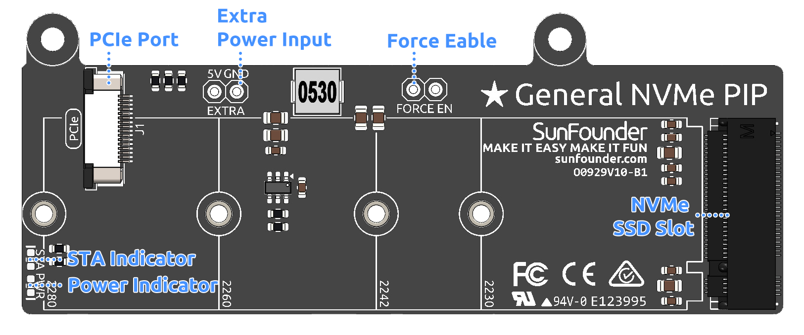

.. note::

    Hello, welcome to the SunFounder Raspberry Pi & Arduino & ESP32 Enthusiasts Community on Facebook! Dive deeper into Raspberry Pi, Arduino, and ESP32 with fellow enthusiasts.

    **Why Join?**

    - **Expert Support**: Solve post-sale issues and technical challenges with help from our community and team.
    - **Learn & Share**: Exchange tips and tutorials to enhance your skills.
    - **Exclusive Previews**: Get early access to new product announcements and sneak peeks.
    - **Special Discounts**: Enjoy exclusive discounts on our newest products.
    - **Festive Promotions and Giveaways**: Take part in giveaways and holiday promotions.

    👉 Ready to explore and create with us? Click [|link_sf_facebook|] and join today!
    
General NVMe PIP
===============================================

.. .. image:: img/O0929V10-PIC.png
..     :align: center

The **General NVMe PIP** allows you to connect an M.2 NVMe SSD to the Raspberry Pi 5's PCIe interface.

The NVMe Kit integrates a PCIe Gen 2 switch with an M.2 M-key PCIe slot supporting 2230, 2242, 2260, and 2280 sizes, allowing the installation of NVMe Gen2 SSDs or AI accelerators.

This compact module is only slightly larger than the SSD itself. It can be mounted either on top of or beside the Raspberry Pi, occupying minimal space and remaining compatible with the installation of the active cooler.

.. note:: It is recommended to use the official 27W power supply for the Raspberry Pi 5 when using it with either Dual NVMe Raft or General NVMe PIP, to ensure sufficient and stable power delivery. Using unofficial, underpowered, or non-compliant power adapters may result in SSDs failing to operate properly.

.. warning:: Never hot-plug NVMe SSDs as it may result in damage to your devices.

-------------------------------------------------

**Features**

- Single-channel PCIe 2.0 interface with a peak transfer rate of up to 500 MB/s
- Supports M.2 NVMe SSDs using the M-Key connector; compatible with sizes 2230, 2242, 2260, and 2280
- Provides up to 3A current output for connected M.2 devices
- Since the Raspberry Pi's PCIe interface provides only 1A (5W), an external 5V power source is recommended when higher power (up to 10W) is required
- Mounts on top or beside the Raspberry Pi, fully compatible with the active cooler
- Includes two custom FPC cables for flexible mounting options
- Features two status LEDs: STA indicates device activity, and PWR shows power status

-----------------------------------------------------------------------

**Hardware Overview**

* **PCIe Port**: Connects to the Raspberry Pi via an FPC cable to transfer PCIe signals between the board and the Pi.
* **Extra Power Input**: Provides additional 5V input when higher power is needed for NVMe SSDs. Useful when the Pi’s PCIe interface cannot supply enough current.
* **Power Indicator**: Indicates whether the board is receiving power. If off, check the PCIe cable or external power.
* **Force Enable**: Forces the 3.3V power supply to turn on regardless of PCIe signal. Use this jumper if the system doesn't provide the power-enable signal.
* **NVMe SSD Slot**: Accepts M.2 NVMe SSDs (M-Key), compatible with 2230, 2242, 2260, and 2280 form factors.
* **STA Indicator**: Indicates the activity status of each NVMe SSD slot. Blinks during data transfer or device activity.

-------------------------------------------------

**Assembly Instructions**

* :download:`[PDF]Component List and Assembly of General NVMe PIP </_static/pdf/Z0318V10-general_nvme_pip.pdf>`
